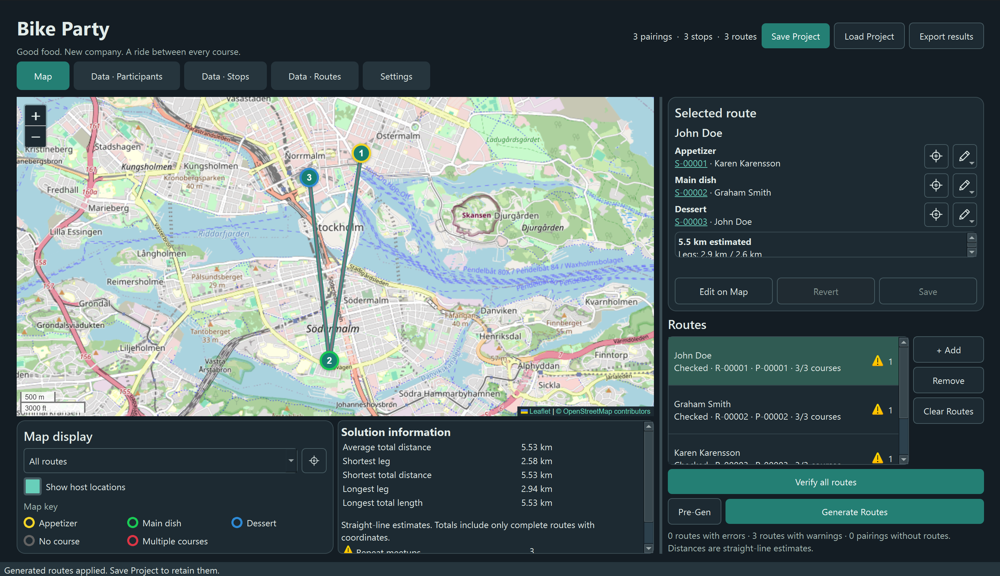

# Map View

[User guide](README.md) · [Settings](<Settings View.md>)

Open the **Map** tab to plan, edit, generate, and verify routes. Each participant record represents a person or pairing travelling together. Their route contains an appetizer, main-dish, and dessert stop.

## Navigating the map

Drag an empty part of the map with the left mouse button to pan. Scroll, or use **+** and **−**, to zoom. The centering icon beside the **Map display** dropdown fits the map to all host locations with known coordinates.

Select a route in the **Routes** list to show its details. Double-click a route segment on the map to select its route and center the map around it. A single click on a segment does not select it.

Hovering over overlapping markers spreads them apart slightly so that you can click them individually. Connected segments follow their markers. They return to their original positions when you move away; saved coordinates do not change.

The map background requires internet access. If a participant is missing from the map, check their coordinates in [Data · Participants](<Participants View.md>) or use **Find Addresses** there.

### Map display and marker outlines

The first dropdown switches between the selected route, all routes, and host locations. **Show host locations** controls additional host markers; selected-route stops remain visible. During editing, the map shows the hosts needed for editing and these display controls are disabled.

The map key below the controls explains the marker outlines:

| Outline | Meaning |
| --- | --- |
| Orange | Hosts an appetizer |
| Green | Hosts a main dish |
| Blue | Hosts a dessert |
| Black | No assigned course |
| Red | Hosts multiple courses |

Outlines reflect stops used by routes. An unused Stops record does not by itself mark an address as hosting a course. Selected-route markers are larger and numbered **1**, **2**, and **3** for the three courses. Reused addresses can show multiple numbers.

Choose the map background separately from the GUI theme using **OSM-data** in Settings.

## Adding and selecting routes

1. Click **+ Add**.
2. Choose a participant from the scrollable list, then click **Select**, or double-click their entry. **Cancel** closes the dialog without adding anything.
3. A route is created, selected, and immediately opened in **Edit on Map** mode.

The picker contains only participants without a route record. Existing empty routes stay in the Routes list. To edit an existing route, select it and click **Edit on Map**.

The **Selected route** panel shows each course's stop and host. Its centering icon moves the map to that stop and is unavailable without coordinates. Its edit icon opens a menu for changing that specific course or clearing its assignment. A change starts or updates a draft, which still needs **Save**.

## Editing on the map

Edits are held in a draft until saved. While a draft is open, route selection and several other actions, including data-table editing, are disabled. Finish with **Save** or **Revert** before continuing elsewhere.

### Assigning stops

Left-click a host marker to fill the first empty course in dinner order. If appetizer and dessert are assigned, clicking fills main dish. Once all courses are assigned, use the course menus, remove an assignment, or drag to remake the route.

You can also hold the left mouse button on one marker and drag to another:

| Start of the drag | Result |
| --- | --- |
| Current main-dish stop | Keeps appetizer and main dish; assigns the endpoint as dessert |
| Any other marker | Replaces the route: start becomes appetizer, endpoint becomes main dish, and dessert is cleared |

When an assigned host has no assignment for that course, the draft also assigns them to their own hosting stop. Saving commits these host assignments along with your route; reverting discards them.

### Safe Edit and marker fills

With **Safe Edit** enabled, a host is eligible for a course when assigned to that same stop or unassigned for that course. Hosts assigned elsewhere cannot be chosen. Eligibility changes as you move through the courses.

Ineligible markers remain visible at **25% opacity**, including stops already on your route, but cannot be assigned. Opacity changes fade over half a second. Course menus offer eligible choices. Disabling Safe Edit allows every host, but verification can still report conflicts.

During editing, marker fills describe the candidate stop for the current course:

| Fill | Meaning |
| --- | --- |
| Blue | Selected participant's own address |
| Green | No guests |
| Lime green | One guest |
| Yellow | Two or more guests |

Guest counts exclude the host and count participant records, which may represent pairs. Colored **outlines** still indicate hosting courses; fills and outlines have different meanings.

### Removing, saving, and reverting assignments

Right-click a stop on the edited route to remove its course assignment. If the address represents multiple courses, choose which assignment to remove. The course edit menu can also clear an assignment.

- **Save** commits the draft and updates related route and stop data. It does not write a project file to disk.
- **Revert** discards changes since entering edit mode. If you just added a route, its empty route record remains.

Use **Save Project** in the top bar to save the whole event to a file.

## Removing routes

**Remove** deletes the selected route record and clears its participant's route reference. That participant becomes available through **+ Add** again. Stops used only by the deleted route are removed; stops referenced by other routes are kept.

**Clear Routes** removes all route records after confirmation. Participants remain available for a new plan. Save a project copy first if you want to retain the current plan.

Clearing a course assignment is different from deleting a route: incomplete and empty route records remain listed until removed.

## Verifying routes

Click **Verify all routes** to check assignments. Warning and error icons in the Routes list show the number of distinct issue types on each route. Hover over an icon to read the issues. **Verify on Change** in Settings updates checks automatically, including changes to drafts; checking a draft does not save it.

### Warnings

| Warning | Trigger |
| --- | --- |
| Route contains stops with few guests | A stop has fewer than two guest records |
| Route contains stops with many guests | A stop has more than two guest records |
| Short Route segment | A known segment is shorter than the preferred minimum |
| Long Route segment | A known segment is longer than the preferred maximum |
| Participant is not hosting | None of the route's stops is hosted by its participant |
| Participant is repeat host | Its participant hosts more than one course on the route |
| Participant is not assigned all 3 stops | At least one course is missing or references a missing stop |
| Repeat meetups | At least two participants attend together at two distinct stops on the route |

### Errors

| Error | Trigger |
| --- | --- |
| Empty route | No stops are assigned |
| Route contains stop(s) without a host | An assigned stop or its host is missing |
| Host already assigned to other stop | A stop's host has another assignment for the same course |
| Route segment exceeds hard maximum distance | A segment exceeds three times the preferred maximum |

Warnings can be ignored individually in [Project Warnings](<Settings View.md#project-warnings>); errors are always reported. Participants without route records are counted separately, rather than reported as empty routes. Missing coordinates prevent distance checks for affected segments.

## Automatic route generation

Before generating, enter participants and find or provide coordinates for every participant. Choose preferred distances and warning priorities in Settings.

### Generate Routes

Click **Generate Routes** to calculate a complete assignment. The progress dialog shows the current stage and elapsed time, with a **Cancel** button. Generation runs in the background within the **Maximum solver time** setting.

The solver requires complete course assignments, hosts present at their stops, and segments no longer than three times the preferred maximum. It tries to reduce warnings, improve weighted penalties, balance travel distances, and reduce total distance. Hosting once, similar group sizes, preferred lengths, and varied meetups are preferences rather than guarantees.

A feasible result opens a review dialog with course assignments, distances, and warnings. Choose **Apply routes** to use it or **Discard** to keep the current data. Cancelling or failing to find a feasible result leaves the project unchanged. Reaching the time limit can still yield a usable result, but does not imply optimality.

Enable **Respect existing routes** to preserve every assigned stop. Empty slots are completed and participants without routes receive routes. Other participants may join existing stops. Conflicting fixed assignments must be repaired, or the setting disabled, before trying again.

## Solution information

The scrollable panel below the map reports average total distance, shortest and longest legs, shortest and longest total route distances, and each warning or error type present with its icon and occurrence count.

Issue counts describe routes reporting that type, not individual offending stops. When automatic verification is off, run **Verify all routes** to update the issue summary.

Distances are straight-line estimates for appetizer → main dish and main dish → dessert. They are not cycling directions and exclude travel from home to appetizer or onwards after dessert. Total-distance statistics use only complete routes with all coordinates; leg statistics include individually measurable segments.

For participant handouts, use **Export results** in the top bar. See [Project files and CSV](<Project Files and CSV.md>).

The second Map display dropdown filters by [data groups](<Data Groups.md>); both dropdowns have equal widths and group options display their colors. **Color by Groups** is initially off. Enable it to add a wider outer outline at 50% opacity to group members while retaining their course outlines. **Verify all routes** and **Generate Routes** are placed side by side below the route list.
